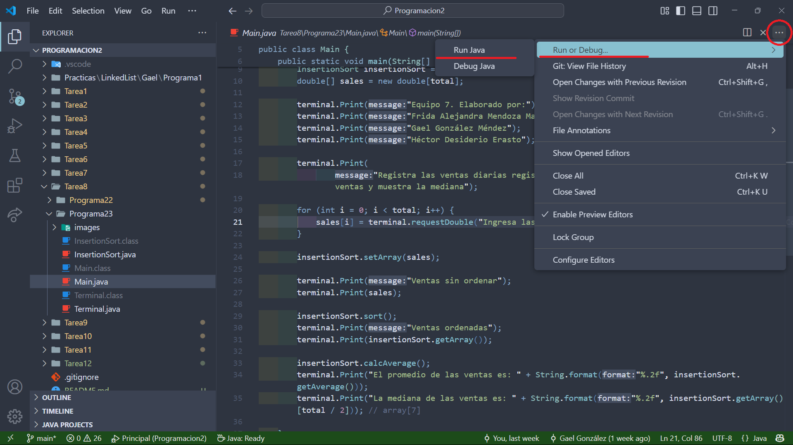

# Programación 2

## Equipo

1. Frida Alejandra Mendoza Martinez
2. Gael González Méndez
3. Hector Desiderio Erasto

## Comandos importantes

### Actualizar _sources.txt_

En una terminal bash (_wsl_ o _git bash_) ejecutar el siguiente comando

```bash
find . -type f -name "\*.java" > sources.txt
```

### Compilar programas

Una vez actualizado _sources.txt_ ejecutar el siguiente programa en una terminal ash (_wsl_, _git bash_ o _cmd_)

```bash
javac @sources.txt
```

### Ejecución del programa

Existen dos formas de ejecutar un programa:

**1.** **Fácil**: Utilizar las opciones integradas de VsCode como se muestra en la imagen a continuación


**2.** **Difícil**: Una vez compilados los programas, puedes utilizar comandos para ejecutar el programa como los que se muestran a continuación (puede ser cualquier terminal, ya sea _wsl_, _bash_, _cmd_, o de preferencia _powershell_)

```bash
java -cp . Tarea1.Programa1.Main
```

```bash
java .\Tarea3\Programa9\Main.java
```
